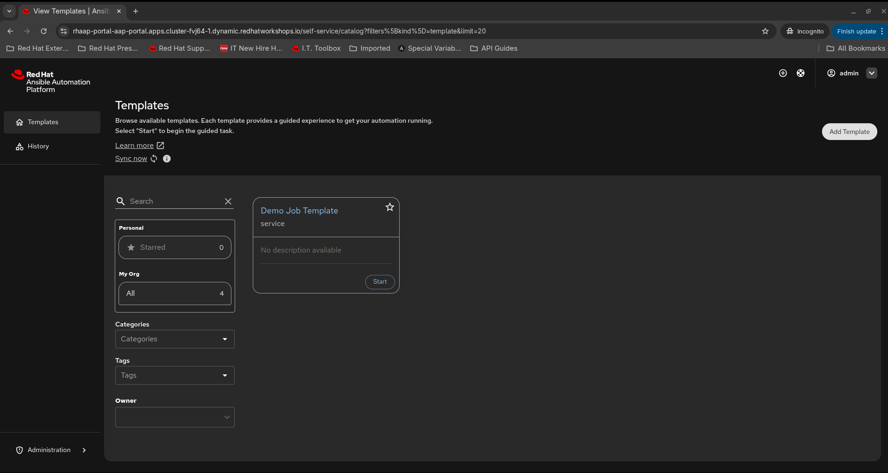
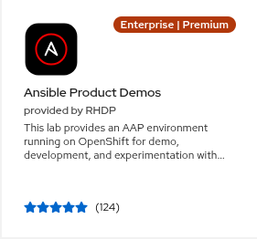

# aap.selfservice

Repeatable build process for the **Red Hat Ansible Automation Platform Self-Service Automation Portal** on OpenShift Container Platform.

## What Is the Self-Service Automation Portal?

The self-service automation portal gives end users a point-and-click web interface to run automation without needing to understand Ansible playbooks or have direct AAP access. It is built on **Red Hat Developer Hub (RHDH)** and deployed as a Helm chart on OpenShift.



Key facts:
- ✅ Syncs Organizations, Users, Teams, and Job Templates from AAP Controller
- ✅ All authenticated portal users can browse templates; AAP enforces execute permissions at launch time
- ✅ Deployed via the `redhat-rhaap-portal` Helm chart from `charts.openshift.io`

## Documentation

| Guide | URL |
|-------|-----|
| Installing Self-Service Automation Portal | https://docs.redhat.com/en/documentation/red_hat_ansible_automation_platform/2.6/html/installing_self-service_automation_portal/index |
| Configuring Self-Service Automation Portal | https://docs.redhat.com/en/documentation/red_hat_ansible_automation_platform/2.6/html/configuring_self-service_automation_portal/index |

## Architecture

```
RHDP Ansible Product Demo
├── AAP 2.6 (already provisioned by RHDP)
│   ├── Automation Controller  ← source of job templates
│   ├── Automation Hub
│   └── Event-Driven Ansible
└── OpenShift (already provisioned by RHDP)
    └── aap.selfservice (this repo)
        └── redhat-rhaap-portal Helm chart
            └── RHDH instance + AAP plugin
```

## Helm Chart

| Field | Value |
|-------|-------|
| Chart name | `redhat-rhaap-portal` |
| Display name | AAP self-service automation portal |
| Repository | `https://charts.openshift.io` |
| Latest version | 2.1.0 |
| Provider | Red Hat |

## Prerequisites

Before running the bootstrap playbook you need:

Order the **Ansible Product Demo** catalog item from the [Red Hat Demo Platform (RHDP)](https://demo.redhat.com) — it provisions items 1–3 automatically.



1. **AAP Controller** — running and accessible (provided by RHDP Ansible Product Demo)
2. **OpenShift** — API access with cluster-admin (provided by RHDP Ansible Product Demo)
3. **`oc` CLI** — logged in to the OCP cluster
4. **`helm` CLI** — available locally
6. **`~/.ansible/secrets2`** — vault password file (one line: your vault password)
7. **Ansible collections** — install once, shared across all repos. Your Automation Hub token must be in `~/.ansible/ansible.cfg` under `[galaxy_server.rh_certified]`. Get it from [console.redhat.com](https://console.redhat.com) → Automation Hub → Connect to Hub → API token. Then install:

```bash
ANSIBLE_CONFIG=~/.ansible/ansible.cfg ansible-galaxy collection install -r collections/requirements.yml
```

Run `/selfservice-first-time` for a guided setup if this is a new machine.

## Getting Started

1. **Install or update Claude Code:**
   - New install: [claude.ai/code](https://claude.ai/code)
   - Already installed: `claude update`

2. **Clone this repo:**
   ```bash
   git clone https://github.com/ericcames/aap.selfservice.git
   cd aap.selfservice
   ```

3. **Launch Claude Code:**
   ```bash
   claude .
   ```

4. **Run the setup skills inside Claude Code:**
   ```
   /selfservice-first-time    ← guided prerequisite setup (first time only)
   /selfservice-bootstrap     ← deploy AAP config + portal (runs all three playbooks)
   /selfservice-sync          ← re-sync after AAP org/team/user changes (day-2)
   ```

## Accessing the Portal

Once deployed, the portal URL follows this pattern — the cluster ID changes with every RHDP provisioning:

```
https://rhaap-portal-aap-portal.apps.<cluster-id>.dynamic.redhatworkshops.io
```

To get the exact URL for your environment:

```bash
oc get route -n aap-portal
```

## Repository Structure

```
aap.selfservice/
├── playbooks/
│   ├── bootstrap_aap.yml      # configures AAP (Hub creds, vault, project)
│   ├── bootstrap_portal.yml   # deploys portal on OpenShift
│   ├── sync_portal_orgs.yml   # patches portal configmap with live AAP org list
│   └── site.yml               # runs all three playbooks in sequence
├── .claude/commands/
│   ├── selfservice-first-time.md  # skill: first-time prerequisite setup
│   ├── selfservice-bootstrap.md   # skill: deploy AAP config + portal
│   └── selfservice-sync.md        # skill: re-sync portal after AAP changes
├── docs/
│   ├── images/                # screenshots and diagrams
│   └── dev-environment.md     # local credentials — gitignored, never commit
├── collections/
│   └── requirements.yml       # pinned collection versions
├── inventories/
│   └── rhdp-sample-demo/      # template inventory — copy for each environment
├── ansible.cfg                # galaxy server config (no tokens)
├── README.md
├── ROADMAP.md
└── CHANGELOG.md
```
